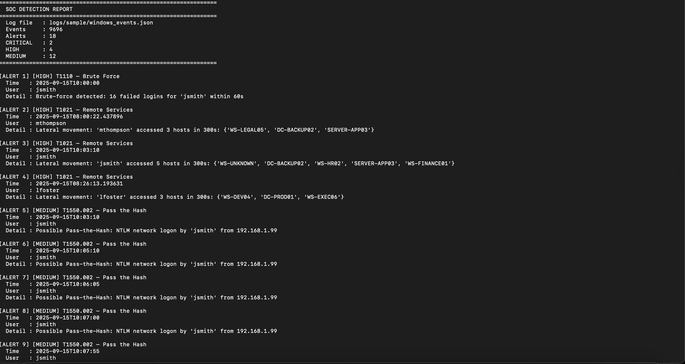
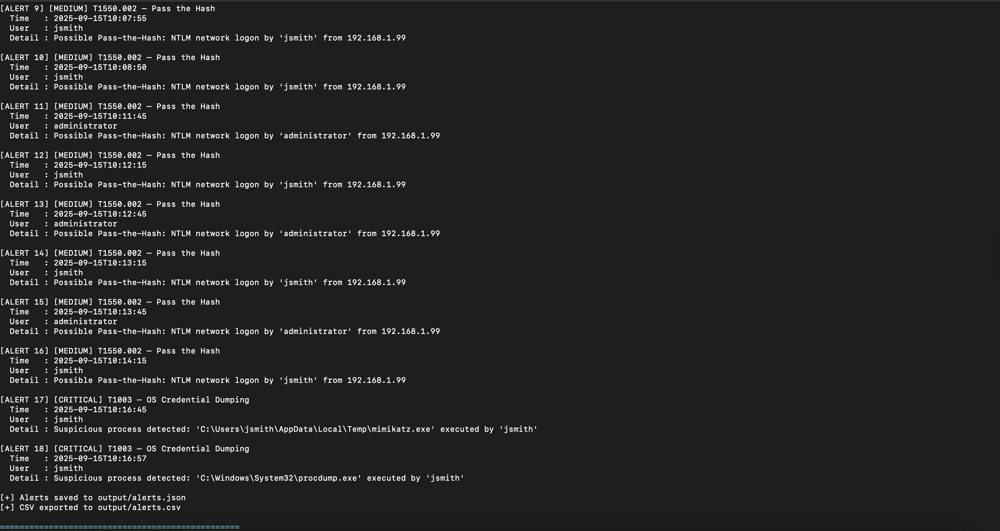

# SOC Detection & Log Analysis Lab

This project started as a way for me to get hands-on with the kind of work a Tier 1/2 SOC analyst actually does — not just reading about it, but building something I could run myself. I wanted to understand how brute-force attacks look in raw log data, how lateral movement leaves a trail across Event IDs, and how to write detection logic that would fire on the right things without drowning in false positives.

The result is a Python-based detection engine that ingests Windows Security Event Logs, correlates events across a simulated 8-hour shift, and maps findings to MITRE ATT&CK. I also built out Splunk SPL queries to replicate the detections in a real SIEM.

---

## What I Built

A custom log analysis pipeline that:
- Parses 9,600+ Windows Security Events (JSON or CSV)
- Detects 4 real attacker techniques using sliding-window correlation
- Maps every alert to a MITRE ATT&CK technique ID
- Exports structured alerts to JSON and CSV for SIEM ingestion
- Includes ready-to-use Splunk SPL queries for each detection

---

## Attack Scenarios & Detections

| Scenario | MITRE ID | Technique | Event IDs | Alert Level |
|---|---|---|---|---|
| Brute-force login campaign | T1110 | Brute Force | 4625 | HIGH |
| Post-compromise lateral movement | T1021 | Remote Services | 4624, 4648 | HIGH |
| NTLM Pass-the-Hash | T1550.002 | Pass the Hash | 4776, 4624 (Type 3) | MEDIUM |
| Mimikatz credential dump | T1003 | OS Cred Dumping | 4688 | CRITICAL |

The simulated attack chain follows a realistic kill chain:
`Brute Force → Initial Access → Lateral Movement → Credential Dumping → Persistence`

---

## Tools Used

- **Python 3** — detection engine, log parser, alert generator
- **Splunk** — SIEM queries (SPL) for real-time detection
- **Windows Event Logs** — Event IDs 4624, 4625, 4648, 4672, 4688, 4776, 7045
- **MITRE ATT&CK** — technique mapping for all detections

---

## Project Structure

```
soc-detection-lab/
├── scripts/
│   ├── log_analyzer.py          # Detection engine — parses logs, fires alerts
│   └── generate_sample_logs.py  # Generates 9,600+ events with attack scenarios
├── detections/
│   └── splunk_queries.spl       # SPL queries for Splunk SIEM
├── logs/sample/
│   └── windows_events.json      # Generated dataset (run generate_sample_logs.py)
├── output/                      # Alert JSON/CSV (auto-created on run)
├── docs/
│   └── setup_guide.md           # Full Splunk + Sysmon environment guide
├── requirements.txt
└── run.sh                       # One-command setup (macOS/Linux)
```

---

## Quick Start

```bash
git clone https://github.com/bilxall/soc-detection-lab.git
cd soc-detection-lab

# Run everything in one shot
chmod +x run.sh && ./run.sh
```

---

## Sample Output





---

## Detection Logic

**Brute Force** — counts Event ID 4625 failures per user in a 60-second sliding window. Fires at 5+ failures from the same source IP.

**Lateral Movement** — tracks unique `WorkstationName` values per user across Type 3 (network) logons. Fires when a user hits 3+ unique hosts within 5 minutes — a pattern that doesn't show up in normal workday traffic.

**Pass-the-Hash** — flags Event ID 4776 (NTLM validation) and Type 3 logins originating from non-local IPs. NTLM network logons from external IPs are almost never legitimate in a domain environment.

**Credential Dumping** — matches `ProcessName` in Event ID 4688 against a list of known offensive tools: mimikatz, procdump, wce, gsecdump, and common LOLBins used for credential theft.

---

## Splunk Queries

All detection logic is also implemented as SPL in [`detections/splunk_queries.spl`](detections/splunk_queries.spl).

**Brute Force:**
```spl
index=windows EventCode=4625
| bucket _time span=5m
| stats count by _time, src_ip, TargetUserName
| where count >= 5
| eval mitre="T1110 - Brute Force"
```

**Lateral Movement:**
```spl
index=windows EventCode=4624 LogonType=3
| bucket _time span=5m
| stats dc(ComputerName) AS unique_hosts by _time, TargetUserName
| where unique_hosts >= 3
| eval mitre="T1021 - Remote Services"
```

---

## What I Learned

Working through this lab, the thing that surprised me most was how much **noise** normal business traffic generates. With 9,600+ events in an 8-hour window, the 66 attack events are less than 1% of total volume. Writing detection logic that catches the attacker without alerting on every Type 3 logon from IT admins required thinking carefully about thresholds, time windows, and correlation — not just pattern matching.

The MITRE ATT&CK mapping also changed how I think about detections. Instead of asking "what does this event mean?", I started asking "what technique does this behavior map to, and what would an analyst need to see to confirm it?" That framing makes the detections much more actionable.

---

## Full Lab Setup

For Splunk + Sysmon + Windows VM setup instructions, see [`docs/setup_guide.md`](docs/setup_guide.md).

---

## Author

**Bilal Ansari** — M.S. Cybersecurity, University of South Florida  
CompTIA Security+ | Google Cybersecurity Professional  
[LinkedIn](https://linkedin.com/in/bilxall) · [GitHub](https://github.com/bilxall)
